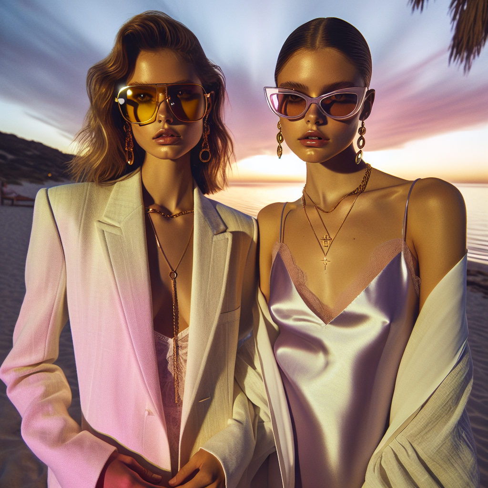

# 🕶️ Summer Sunglasses Campaign – Executive Summary

## 📊 Refined Trend Insights
Executive Summary  
As we prepare to launch our Summer 2025 sunglasses line, three defining trends will drive consumer demand: chain-adorned frames, vibrant tinted lenses, and the resurgence of oversized and cat-eye silhouettes. By spotlighting two hero SKUs—“Aviator” (SG001) and “Mystique” (SG003)—we can deliver a cohesive, on-trend assortment that captures both street-style credibility and premium appeal.

Key Trends  
1. Chain-Adorned Frames  
   • Function meets fashion: detachable chains and straps deliver a Y2K-inspired, luxury flair while ensuring eyewear stays close at hand.  
2. Colorful Tints  
   • Statement hues such as millennial pink, lemon yellow, and lavender are defining summer 2025, adding playfulness and standout appeal.  
3. Oversized & Cat-Eye Revivals  
   • Supersized aviator/bug-eye shapes channel ’90s “Cool Girl” energy; refined cat-eyes revisit the elegance of the ’60s.

Featured Products  
• SG001 “Aviator”  
  – Leverages the top-selling oversized silhouette in a sleek, thin-metal frame  
  – Chain-ready design aligns directly with the chain-adorned trend  
• SG003 “Mystique”  
  – Modern cat-eye with sweeping temples captures vintage revival  
  – Customizable tinted lenses enable instant play on the colorful-tint movement

Strategic Rationale  
• Dual-trend alignment: Both models satisfy two major consumer demands—statement shapes and decorative functionality—maximizing halo impact.  
• Hero positioning: “Aviator” anchors our sporty-luxury narrative; “Mystique” establishes our fashion-forward credentials.  

By prioritizing these two SKUs, we will deliver a sharply focused campaign that resonates with trend-conscious consumers and amplifies our brand’s premium position for Summer 2025.

## 🎯 Campaign Visual

    

## ✍️ Campaign Quote
Chain-Adorned Aviators, Pastel Cat-Eyes: Summer’s Luxe Revival

## ✅ Why This Works
This headline spotlights the two hero silhouettes—oversized aviators with decorative chains and pastel-tinted cat-eyes—while evoking the sunset beach backdrop and the Y2K-inspired, luxury-meets-playful vibe of Summer 2025.

---

*Report generated on 2025-12-14*
